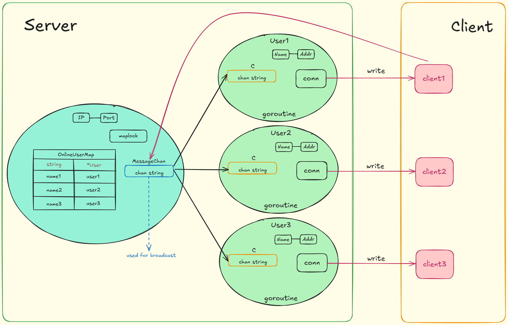

# Go-IM-System
#### This is a little proj used for learning go.

**It is a simple instant messaging system written in Go, demonstrating basic networking and concurrency features. The project includes a server that handles multiple clients, allowing them to send and receive messages in real-time.**

---

### The Architecture

